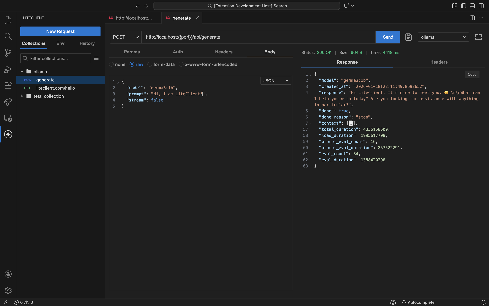

# LiteClient

<div align="center">

[](https://marketplace.visualstudio.com/items?itemName=liteclienthq.liteclient)
[](https://marketplace.visualstudio.com/items?itemName=liteclienthq.liteclient)
[](https://open-vsx.org/extension/liteclienthq/liteclient)
[](https://open-vsx.org/extension/liteclienthq/liteclient)
<br/>
[](https://github.com/liteclienthq/liteclient)
[](https://github.com/liteclienthq/liteclient)

**The fastest, most focused REST API client for your code editor.**

</div>

---

LiteClient is a native VS Code extension that brings a powerful REST API client directly into your editor. No more context switching between your IDE and external tools. Make HTTP requests, manage environments, and organize your API collections without leaving VS Code.



## Why LiteClient?

Modern API clients have become bloated with cloud accounts, telemetry, and features you never use. LiteClient returns to the fundamentals:

- **Zero Startup Time** - Opens instantly with your workspace
- **Total Privacy** - All data stays local. No accounts, no telemetry, no cloud sync
- **Native UX** - Uses VS Code's native buttons, trees, and themes
- **Focused Features** - Everything you need, nothing you don't

## Features

### Collections

Organize your API requests in a hierarchical structure that grows with your project.

- Create unlimited collections to group related APIs
- Nest requests inside folders for logical organization
- Drag-and-drop reordering to keep things organized
- Save requests with full configuration (URL, headers, body, auth)
- Postman Collection v2.1 import for easy migration
- Export collections to share with your team

### Environments

Manage different configurations for local, staging, and production environments.

- Create named environments with custom variables
- Global variables available in all environments
- Quick-switch between environments via the sidebar
- Variables work everywhere: URL, headers, body, auth
- Protected storage for sensitive values

### HTTP Request Building

Build requests with precision using a familiar interface.

**Request Methods**
- GET, POST, PUT, PATCH, DELETE, HEAD, OPTIONS

**URL & Parameters**
- Full URL input with variable support
- Query parameters editor with enable/disable toggle
- Variable autocomplete - type `{{` to see available variables

**Headers**
- Custom headers with key-value pairs
- Enable/disable individual headers
- Variable substitution in both keys and values

**Request Body**
- No body option for GET/HEAD requests
- Raw body with syntax highlighting (JSON, XML, HTML, JavaScript, text)
- Form-data with file upload support (25MB limit)
- URL-encoded form data
- Variable substitution in all body types

### Authentication

Comprehensive authentication support for modern APIs.

**API Key**
- Custom header or query parameter placement
- Flexible key/value configuration

**Bearer Token**
- Simple token-based authentication
- Variable support for tokens

**Basic Auth**
- Username/password credentials
- Automatic Base64 encoding

**OAuth 2.0**
- **Authorization Code** - Traditional flow with browser-based authentication
- **Authorization Code with PKCE** - Enhanced security for public clients
- **Client Credentials** - Machine-to-machine authentication
- Automatic token caching in secure storage
- Token refresh when tokens expire
- Configurable scopes and audience

### Response Analysis

View responses with rich formatting and metadata.

- Syntax-highlighted response body
- Automatic language detection (JSON, XML, HTML, JavaScript)
- Response status codes and status text
- Response headers display
- Response cookies with domain, path, and expiration
- Execution timing in milliseconds
- Request cancel during long-running operations

### History Tracking

Never lose track of what you've tried.

- Automatic history recording for every request
- Day-grouped organization (Today, Yesterday, Last Week)
- Request method and URL at a glance
- Execution duration tracking
- Quick replay of historical requests
- Bulk delete by day or individual items
- Clear all history option

### Cookie Management

Built-in cookie jar for session management.

- Automatic cookie sending based on domain
- Cookie persistence across VS Code sessions
- Dedicated Cookie Manager panel
- View all cookies grouped by domain
- Delete individual cookies or entire domains
- Clear all cookies option

### Multi-Tab Editing

Work on multiple requests simultaneously.

- Multiple request panels open at once
- Unsaved changes indicator
- Drag tabs to reorder
- Custom `.lcreq` file type for direct file opening
- Tab icons for easy identification

### Variable System

Dynamic variable substitution throughout requests.

```
{{baseUrl}}/api/users
{{apiKey}}
{{environmentVariable}}
```

- Available everywhere: URL, headers, body, auth
- Autocomplete dropdown with arrow key navigation
- Global variables always available
- Environment-scoped variables for different configurations

## Installation

### VS Code Marketplace (Recommended)

1. Open VS Code
2. Press `Ctrl+Shift+X` (Windows/Linux) or `Cmd+Shift+X` (macOS)
3. Search for "LiteClient"
4. Click Install

### Alternative Installation

**Open VSX Registry**
- Visit [open-vsx.org/extension/liteclienthq/liteclient](https://open-vsx.org/extension/liteclienthq/liteclient)
- Download the VSIX file
- Run: `code --install-extension liteclienthq.liteclient-{version}.vsix`

**From Source**
```bash
git clone https://github.com/liteclienthq/liteclient.git
cd liteclient
npm install
npm run build
# Install from dist/*.vsix
```

## Quick Start

### Your First Request

1. Open the LiteClient sidebar from the Activity Bar
2. Click **New Request** (or press `Ctrl+Shift+P` → "LiteClient: New Request")
3. Enter your URL (e.g., `https://jsonplaceholder.typicode.com/users`)
4. Select the HTTP method from the dropdown
5. Click **Send**
6. View the response in the panel below

### Creating an Environment

1. Switch to the **Env** tab in the sidebar
2. Click **New Environment**
3. Enter a name (e.g., "Development")
4. Click **Add Variable**
5. Enter variable name and value (e.g., `baseUrl` = `http://localhost:3000`)
6. Select the environment from the dropdown in any request panel

### Organizing with Collections

1. Switch to the **Collections** tab in the sidebar
2. Click **New Collection**
3. Enter a collection name
4. Click **Add Request** to create your first request
5. Use **New Folder** to organize related requests
6. Drag items to reorder or move between collections

### Importing from Postman

1. In the Collections tab, click **Add Collection**
2. Select **Import from Postman**
3. Choose a Postman Collection v2.1 JSON file
4. Requests, folders, and metadata are imported automatically

## Authentication Guide

### Setting Up API Key Auth

1. Open a request panel
2. Click the **Auth** tab
3. Select **API Key** from the dropdown
4. Enter the key name and value
5. Choose **Header** or **Query** for placement

### Configuring OAuth 2.0

1. Open a request panel
2. Click the **Auth** tab
3. Select **OAuth 2.0** from the dropdown
4. Choose grant type:
   - **Authorization Code**: Requires user login via browser
   - **Authorization Code (PKCE)**: Enhanced security, no client secret
   - **Client Credentials**: Direct token exchange
5. Configure endpoints (Authorization URL, Token URL)
6. Enter Client ID and Secret
7. Add scopes if required by your API
8. Click **Get Access Token**
9. The token is automatically saved and injected in requests

## Keyboard Shortcuts

| Action | Windows/Linux | macOS |
|--------|---------------|-------|
| New Request | `Ctrl+Shift+P` → "LiteClient: New Request" | `Cmd+Shift+P` → "LiteClient: New Request" |
| Send Request | `Ctrl+Enter` | `Cmd+Enter` |
| Focus URL Bar | `Ctrl+L` | `Cmd+L` |

## Troubleshooting

### Variables Not Substituting

If variables appear unchanged in requests:
1. Ensure an environment is selected in the sidebar
2. Verify the variable exists in the active environment
3. Check for typos in the variable name (`{{name}}` not `{{nam}}`)
4. Global variables are always available regardless of selected environment

### Request Fails with "Invalid URL"

1. Verify the URL starts with `http://` or `https://`
2. Check for unresolved variables (`{{port}}` without defining `port`)
3. Test the URL in a browser to confirm the endpoint exists

### Cookies Not Being Sent

1. Ensure the Cookie Jar is enabled (default)
2. Check that cookies match the request domain
3. Verify cookie hasn't expired
4. Use Cookie Manager to inspect stored cookies

### OAuth Token Expired

1. Tokens automatically refresh when possible
2. If refresh fails, re-authenticate via the Auth tab
3. Check that token URL is correct in OAuth configuration

### Response Body Not Formatted

1. Response formatting requires proper Content-Type header
2. JSON responses are auto-formatted
3. Other content types display as plain text

## Privacy & Security

LiteClient is designed with privacy as a core principle.

- **Local Storage Only** - All data stored in VS Code's global storage
- **No Telemetry** - No analytics, tracking, or usage data collection
- **No Cloud Sync** - Your data never leaves your machine
- **Secure Token Storage** - OAuth tokens stored in VS Code's SecretStorage
- **Open Source** - Audit the code yourself on GitHub

Your API keys and credentials are stored locally. Only you can access them.

## Support & Feedback

- **Report Bugs**: [GitHub Issues](https://github.com/liteclienthq/liteclient/issues)
- **Feature Requests**: [GitHub Discussions](https://github.com/liteclienthq/liteclient/discussions)
- **Website**: [liteclient.com](https://liteclient.com)
- **Source Code**: [github.com/liteclienthq/liteclient](https://github.com/liteclienthq/liteclient)

## Contributing

Contributions are welcome! Please read our [Contributing Guide](CONTRIBUTING.md) for details.

## License

MIT License - see [LICENSE](LICENSE) for details.

---

<div align="center">
  Built with ❤️ by the LiteClient Team
</div>
